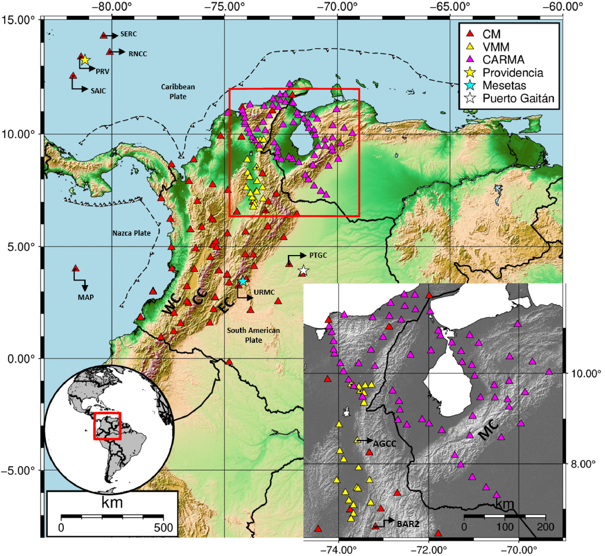
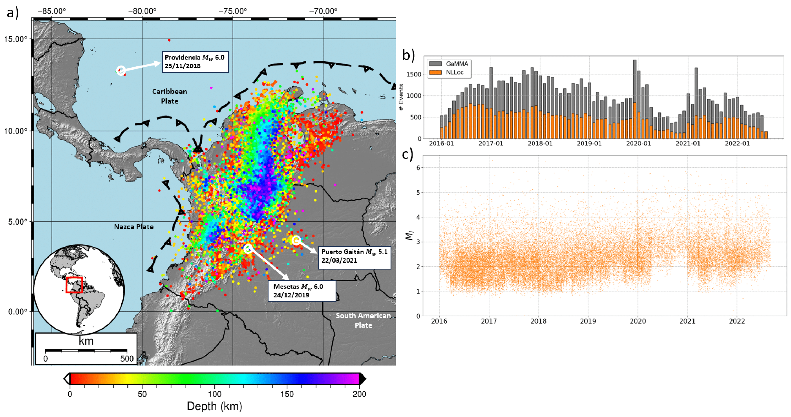

   

  
# A package for seismological monitoring.
#### [Downloader->Picker->Associator->Locator->Magnitude]
For now only supported for linux

# Documentation (In progress)

[Documentation](https://seismonitor.readthedocs.io/en/latest/)

# Examples

Feel free to ask me if you have any doubts: castillo.280997@gmail.com. I am trying little by little to have everything up for everyone.

| Examples |  |
|---|---|
| 1.downloader| [](https://colab.research.google.com/github/ecastillot/SeisMonitor/blob/master/examples/1.downloader.ipynb) |
| 2.picker| [](https://colab.research.google.com/github/ecastillot/SeisMonitor/blob/master/examples/2.picker.ipynb) |
| 3.associator| [](https://colab.research.google.com/github/ecastillot/SeisMonitor/blob/master/examples/3.associator.ipynb) |
| 4.locator| [](https://colab.research.google.com/github/ecastillot/SeisMonitor/blob/master/examples/4.locator.ipynb) | 
| 5.magnitude| [](https://colab.research.google.com/github/ecastillot/SeisMonitor/blob/master/examples/5.magnitude.ipynb) | 
| 0.seismonitor (All-in-one)| [](https://colab.research.google.com/github/ecastillot/SeisMonitor/blob/master/examples/monitor.ipynb) |
 


# Installation

## pip
```bash
pip install SeisMonitor
pip install git+https://github.com/ecastillot/EQTransformer.git@master
pip install git+https://github.com/wayneweiqiang/GaMMA.git
```
## conda
```bash
conda create --name seismonitor python=3.10
conda activate seismonitor
pip install SeisMonitor
pip install git+https://github.com/ecastillot/EQTransformer.git@master
pip install git+https://github.com/wayneweiqiang/GaMMA.git
```

# Colombian Catalog

Castillo, E., Prieto, G.A., Siervo, D. (2024). Colombian seismic monitoring using advanced machine-learning algorithms. Seism. Res. Lett. [PDF](https://gaprieto.com/wp-content/uploads/2024/05/gprieto_24c.pdf) 

| Data |  |
|---|---|
| EQTransformer-picks| [Open](https://drive.google.com/file/d/1e3044OJBtFjg4HrrbawEJ-3GfqjN-Cbf/view?usp=sharing) |
| GaMMA-catalog| [Open](https://drive.google.com/file/d/1OnMDNe4NZK98mNLjdrFhZNy14dJHZXhX/view?usp=drive_link) |
| GaMMA-picks| [Open](https://drive.google.com/file/d/1qJhRHIYpFh8_TyWV0KyOvq9nj4y_zz5T/view?usp=drive_link) |
| SeisMonitor-catalog| [Open](https://drive.google.com/file/d/1ZphhiOkZkeOZBwBVPmXmVsXp7WL0ZjEL/view?usp=sharing) |
| SeisMonitor-picks| [Open](https://drive.google.com/file/d/1SS1OysOSk-9l-gFRpuCORRgXvwTKeniG/view?usp=sharing) | 





<!-- | Examples |  |
|---|---|
| 1.downloader| [](https://colab.research.google.com/github/ecastillot/SeisMonitor/blob/master/examples/1.downloader.ipynb) |
| 2.picker| [](https://colab.research.google.com/github/ecastillot/SeisMonitor/blob/master/examples/2.picker.ipynb) |
| 3.associator| [](https://colab.research.google.com/github/ecastillot/SeisMonitor/blob/master/examples/3.associator.ipynb) |
| 4.locator| [](https://colab.research.google.com/github/ecastillot/SeisMonitor/blob/master/examples/4.locator.ipynb) | -->
